# Luca's Pizza Blog

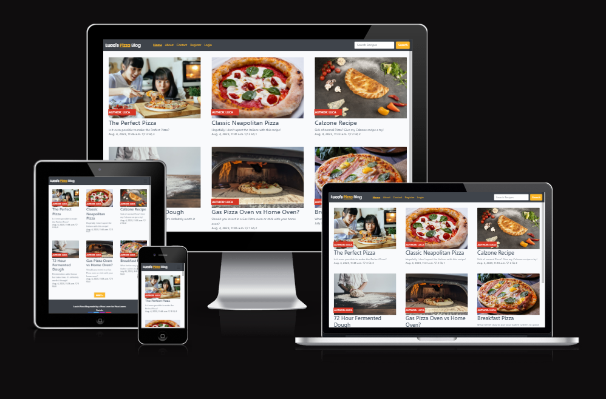

Luca's Pizza Blog is a full-stack, responsive website built for a Pizza Chef looking to share and educate users on the art of pizza.

It provides the user value by learning about the blogger and recipes they post about. It has a Search Box that enables the user to search for specific recipes. Users can register an account, view blog posts, like blog posts and add / edit / delete comments they make on a specific blog post.

# [Link to Live Website](https://garys-pizza-blog-f13a1d85eaa1.herokuapp.com/)

## Table of Contents
* [Overview](#overview)
* [Agile Methodology](#agile-methodology)
* [User Experience (UX)](#user-experience-ux)
    * [Site Goals](#site-goals)
    * [Scope / User Stories](#scope--user-stores)
    * [Wireframes](#wireframes)
    * [Design Choices](#design-choices)
    * [Database Design](#database-design)
* [Features](#features)
    * [Existing Features](#existing-features)
    * [Future Features](#future-features)
* [Technologies Used](#technologies-used)
    * [Languages](#languages)
    * [Libraries & Frameworks](#libraries--frameworks)
    * [Tools](#tools)
* [Testing](#testing)
* [Deployment](#deployment)
* [Credits](#credits)
* [Acknowledgements](#acknowledgements)

____

## Overview

Luca's Pizza Blog is a responsive, mobile-first website. It is compatiable with all current major browsers. The website is built for educational purposes, using Bootstrap and Django Framework. It gives users the ability to register for an account, like blog posts, add comments, edit & delete their comments. Full CRUD functionality on comments. As well as an About Page for users to read more about Luca and his experience as a Pizza Chef.

[Back to  Top](#table-of-contents)

____

## Agile Methodology

This project was planned using Agile Methodology. GitHub Issues was used to create user stories which can be viewed [here](https://github.com/GaryS007/Portfolio-Project-4/issues). Each User Story helped me understand a User/Admin requirements when using the blog site I had in mind. This was my first time using this methodology and the Django framework, so I feel like I could have used the user stories to dictate the priority of each future iteration. All of which can be implemented in Project 5.

I really felt that using Agile Method helped me stay focused on what tasks need to be completed. I can simply move a task to To Do for the next day and plan out which tasks can be completed so I stay focused and on schedule with my project. It also really helps manage expectations and time. Finally, who doesn't love putting a task in the 'done' section when completed!

[Back to Top](#table-of-contents)

____

## User Experience (UX)

### Site Goals

Luca's Pizza Blog is designed to entice people into learning about various pizza recipes but also to engage with a pizza chef and pizza community. It displays Blog Posts on the homepage with vibrant images and short descriptions to entice new users. Each Blog Post contains a new and unique recipe, which enables the user to engage with that content by liking or commenting on the post. It also provides information about the Pizza Chef via the about page. I wanted to include additional functionality by enabling any user to Search or Filter for recipes that they might be more interested in. This feature will become increasingly more useful as more blog posts get added, preventing the need to scroll through pages of content.

The target audience are pizza lovers of all ages that want to gain additional experience from a trained pizza chef.

____

### Scope / User Stores

**As a Site Admin / Blog Owner**

* I can create, read, update and delete posts which enables me to manage my blog content.[#9](https://github.com/GaryS007/Portfolio-Project-4/issues/9)
* I can Approve / Dissapprove user comments to prevent spam and to filter out negative comments.[#11](https://github.com/GaryS007/Portfolio-Project-4/issues/11)
* I can create a blog post draft so that I can save that draft and finish it later.[#10](https://github.com/GaryS007/Portfolio-Project-4/issues/10)
* I can view the number of likes and comments on each post so that I can see which post is the most successful.[#5](https://github.com/GaryS007/Portfolio-Project-4/issues/5)
* I can add content to my about page so that users can read more about the blogger. [#15](https://github.com/GaryS007/Portfolio-Project-4/issues/15)
* I can add content to the contact page so that users can get in touch with the blogger. [#17](https://github.com/GaryS007/Portfolio-Project-4/issues/17)
<br>

**As a User**
<br>

* I can see the website's logo and links at the top of the page so that I can easily navigate to all parts of the website. [#1](https://github.com/GaryS007/Portfolio-Project-4/issues/1)
* I can click on a blog post and read the full post.[#2](https://github.com/GaryS007/Portfolio-Project-4/issues/2)
* I can read more information about the blogger.[#13](https://github.com/GaryS007/Portfolio-Project-4/issues/13)
* I can use the search box to search for specific recipes.[#14](https://github.com/GaryS007/Portfolio-Project-4/issues/14)
* I can Register a new account so I can post, like and comment.[#6](https://github.com/GaryS007/Portfolio-Project-4/issues/6)
* I can contact the blogger directly. [#17](https://github.com/GaryS007/Portfolio-Project-4/issues/17)

**As a Returning User**
* I can use my Username and Password in order to login to my account.[#6](https://github.com/GaryS007/Portfolio-Project-4/issues/6)
* I can post a comment on a specific blog post.[#4](https://github.com/GaryS007/Portfolio-Project-4/issues/4)
* I can like or unlike blog posts so that I can interact with the content.[#5](https://github.com/GaryS007/Portfolio-Project-4/issues/5)
* I can Edit / Delete a comment made by my account.[#12](https://github.com/GaryS007/Portfolio-Project-4/issues/12)
* I can see how many comments a blog post has so that I see how viral the post is. [#18](https://github.com/GaryS007/Portfolio-Project-4/issues/18)

____

### Wireframes

I created Wireframes using [Balsamiq](https://balsamiq.com/wireframes/) to help visualize how the final site would look and to allow me to plan accordingly. This method really helps me know where each element needs to go, while it might not look the same as the final version, it allows me to tick a lot of boxes then I can make final changes during the building phase where necessary.

**Homepage**
<details>
<summary>Click to view - Homepage Wireframes</summary>

#### Mobile


#### Desktop

</details>
</br>

**Blog Post**
<details>
<summary>Click to view - Blog Post Wireframes</summary>

#### Mobile


#### Desktop

</details>
</br>

**Edit Comment - Blog Post**
<details>
<summary>Click to view - Edit Comment Wireframes</summary>

#### Mobile


#### Desktop

</details>
</br>

**Delete Comment - Blog Post**
<details>
<summary>Click to view - Delete Comment Wireframes</summary>

#### Mobile


#### Desktop

</details>
</br>

**About Page**
<details>
<summary>Click to view - About Wireframes</summary>

#### Mobile


#### Desktop

</details>
</br>

**Contact Page**
<details>
<summary>Click to view - Contact Page Wireframes</summary>

#### Mobile


#### Desktop

</details>
</br>

**Search Page**
<details>
<summary>Click to view - Search Page Wireframes</summary>

#### Mobile


#### Desktop

</details>
</br>

**Register User Page**
<details>
<summary>Click to view - Register/Signup Page Wireframes</summary>

#### Mobile


#### Desktop

</details>
</br>

**Login Page**
<details>
<summary>Click to view - Login Page Wireframes</summary>

#### Mobile


#### Desktop

</details>


### Design Choices

This section defines the visual decisions of the website

* Colour Scheme

Using [Canva](https://www.canva.com/colors/color-palette-generator/) a Black, Yellow and Red colour palette was chosen for this website. Keeping the Header Black with the Yellow colour to allow all nav items and buttons to pop. Then I kept the Red as that is a general pizza colour (tomato sauce!) which felt very relevant for the blog. It resulted in a professional yet vibrant feel to the website.


Punch (Red) was used to provide the pop of colour where needed.
Mako (Black) was used for the header and footer for the professional look.
Tulip Tree (Yellow) was used for Navigation, Buttons and some in the text logo.

* Typography

[Google Fonts](https://fonts.google.com/) Poppins and Lato were used throughout the site. Both of which are Sans-Serif and make the site very readable.

* Icons

[Font Awesome](https://fontawesome.com/) icons were used throughout the website, primarily in the Footer for social icons and also on the blog page for Likes and Comment icons. All of which are interactive.

[Back to Top](#table-of-contents)

### Database Design

I created an entity relationship using [draw.io](https://app.diagrams.net/). This helped me understand the database design and what field each model would require.

<details>
<summary>Click to view Entity Relationship Diagram</summary>

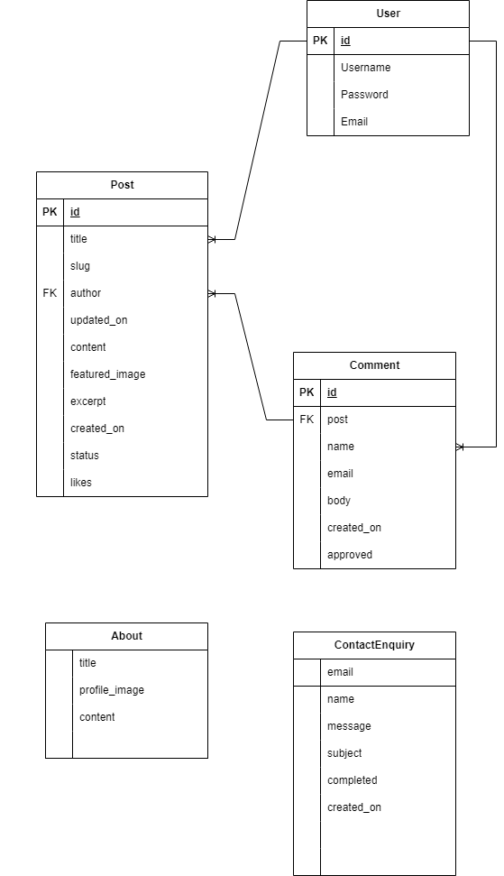

</details>
<br>

My custom models were influenced by the I Think Therefore I blog project. I customized them slightly, including a function to the Post model to show a comment count on the home page. As well as that, I changed some attributes to various models.

* **The About Model** enables an admin to update Image & Text content on the About Page via Django Admin. This was created as an entirely separate app. The About Model has 3 fields.

    - title (CharField)
    - profile_image (CloudinaryField)
    - content (TextField)

* **The ContactEnquiry Model** is for the Contact Page, I created a custom form and model to achieve this. The Admin can view all contact form entries in the Django admin and use the Completed field to mark each one as completed after they have acknowledged the message or responded. The ContactEnquiry Model has 6 fields.

    - email (EmailField)
    - name (CharField)
    - message (TextField)
    - subject (CharField)
    - completed (BooleanField)
    - created_on (DateTimeField)
<br>

[Back to Top](#table-of-contents)
____

## Features

### Existing Features

**Header & Nav**

The header and navigation are featured on all pages and are fully responsive. They include:

* A friendly yet simple logo.
* When on Mobile the navigation can be accessed through the traditional burger menu. Once clicked the drop down will display each individual page including; Home, About, Contact, Login, Register, Logout and a search box. The burger menu keeps the focus on the content of the page and has become a very familiar method among mobile users to access the navigation items. All links have hover effects and active effects when a main page is accessed.
* The search box enables users who want to search for a specific recipe or blog post that would suit their interests. 
* The Login/Register/Logout options change depending on the users status. If they're not logged in, they will be given an option to Register or Login. If they are logged in, the previously mentioned items will disappear and the only remaining option will be Logout.
* When on Desktop the activity is the same but the menu items are not collapsable like in the burger menu.

<details>

<summary>Click to view - Navigation Screenshots</summary>

**Mobile & Desktop Navigation**

**Closed Menu Mobile**


</br>

**Open Menu Mobile**


</br>

**Desktop Navigation**


[Back to Top](#table-of-contents)

</details>
</br>

**Footer**

Just like the header and nav, the Footer is featured on all pages and is responsive. The footer enables visitors to the website to view the bloggers social links so they can further network and view the bloggers content on other platforms/applications. It includes:

* Short attractive summary of website.
* Vibrant Social Media Icons allowing users to connect further with Luca.
* Copyright information in a subtle colour.

<details>

<summary>Click to view - Footer Screenshots</summary>

**Footer on Mobile**


**Footer on Desktop**


</details>

**Homepage**

The Home Page which is responsive, displays all blog posts, each post has an attractive image and excerpt to attract users. It includes:
* Vibrant Imagery relevant to the blog post to entice a click.
* Each Image and Title is a clickable URL which will take them to the blog post. This makes it more mobile friendly when the image is clickable.
* Each blog post contains a title and excerpt to provide additional information on what the post is about.
* The popularity of the Blog post is displayed via the Heart Icon and the Comment Icon.
* The Author is posted over the image so they can see who made the post.
* The date and time is displayed so the user can see when the post was made.
* The next button is at the bottom of the page content so users can read more posts.

<details>

<summary>Click to view - Homepage Screenshots</summary>

**Home Page on Mobile**


**Home Page on Desktop**


</details>
</br>

**Blog Posts**

Each Blog Post is responsive, can be accessed via the main blog (Home page). Each blog post can be populated by the blogger via the Django Admin. It includes:
* A title relevant to the blog post.
* A Vibrant image that will be displayed at the top of the page.
* The author and date the blog post was made.
* A full detail content section for the blog post.
* A Like Icon and a Comment icon to show how viral the blog post is.
* The ability for an authenticated user to make a comment on the post.
* The ability for all website viewers to read all comments.
* Blog Posts can be made via Django.
* Comments made by authenticated users can be approved by an admin in Django.

<details>

<summary>Click to view - Blog Post Screenshots</summary>

**Blog Post on Mobile**


**Blog Post on Desktop**

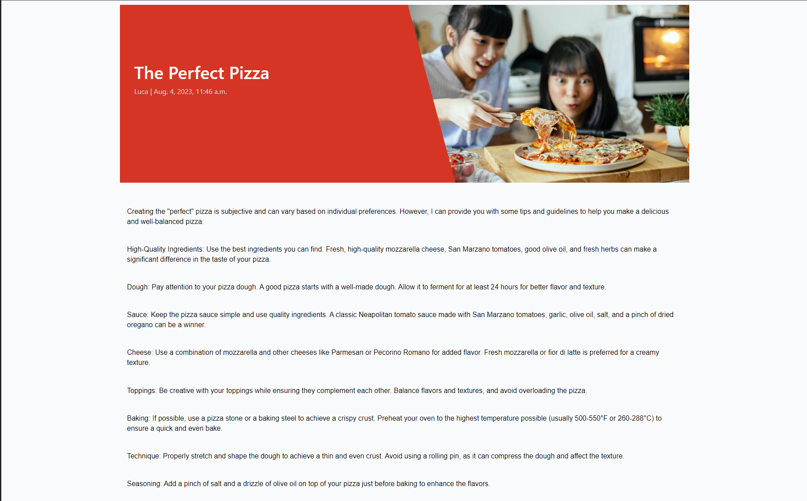
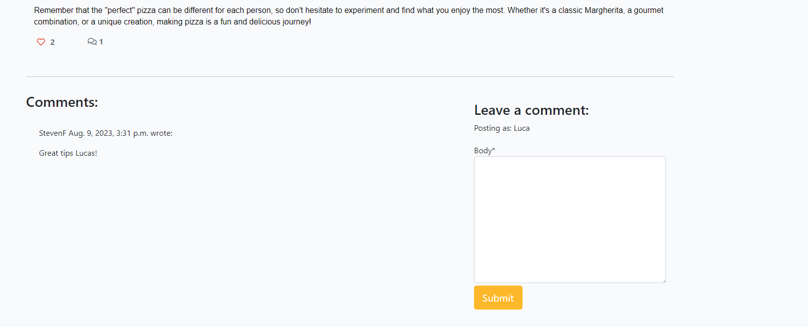

</details>
</br>

**Comments**

Any registered User has the ability to comment on a specific blog post, they can comment multiple times on as many blog posts as they want to and has full CRUD functionality.
* A user must be logged in order to have access to posting a comment.
* All comments made by a user must be approved by an Admin.
* Until the comment is approved, it will be displayed as faded and a message clearly stating that it's awaiting admin approval.
* Once commented, an alert message will confirm that the comment has been made.
* Once a comment has been made, even if not approved the user can Delete or Edit their message.
* If a Comment has been approved by a Moderator, when Edited it will revert back to Unapproved automatically.
* If Edited, the 'Submit' button will automatically change to 'Update' and the comment body will be populated with their current message.
* If they click Delete, a Modal will appear asking them to confirm if they want to delete the comment to prevent missclicks.
* Depending on the option they choose there will be consistent alert messages for each option Add/Edit/Delete.
* When commenting, it will show you the name of the logged in user by saying 'Posting as: USERNAME'.

<details>
<summary>Click to view - Comments Screenshots</summary>

**Comments on Mobile**
</br>


</br>

**Edit / Delete buttons**
</br>


</br>

**Edit Comment**
</br>

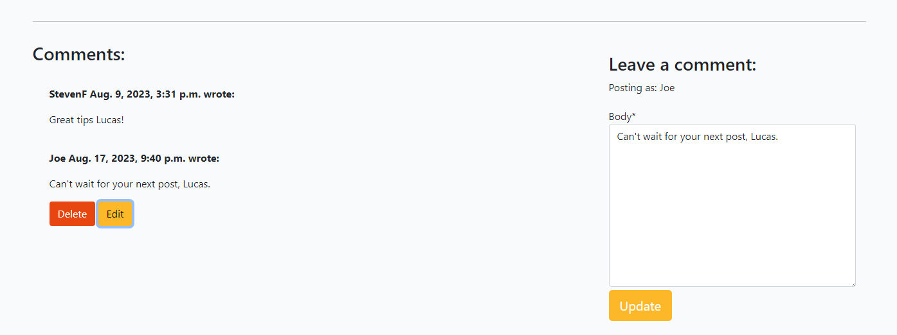

</br>

**Delete Comment Modal**
</br>

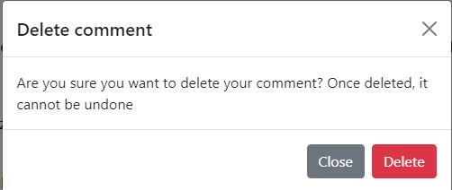
</br>

**Awaiting Moderator**
</br>


</details>
</br>

**About Page**

The About Page which is responsive, can be accessed via the navigation bar at the top of the website. This page can be managed via Django Admin, allowing the blogger who may not have any website experience to quickly and easily change the image or content. It includes:
* Detailed information about Luca, why he created the blog, his history and experience. For anyone reading the blog posts, this page allows users to understand and connect with Luca even more.
* An Image of Luca in his element showing off his Pizza.

<details>
<summary>Click to view - About Page Screenshots</summary>

**About Page on Mobile**


**About Page on Desktop**


</details>
</br>

**Contact Page**

The Contact Page is responsive and can be accessed via the navigation bar at the top of the website. It's a Django form which enables a website visitor to get in touch with Luca in relation to his blog or general enquiries feedback. All Queries are displayed via Django Admin where he can mark them as completed after he has finished responding to them. Essentially using Django as a ticketing system. It includes:
* Page title.
* Contact us content section.
* Contact form to get in touch with the blog owner.

<details>
<summary>Click to view - Contact Page Screenshots</summary>

**Contact Page on Mobile**


**Contact Page on Desktop**
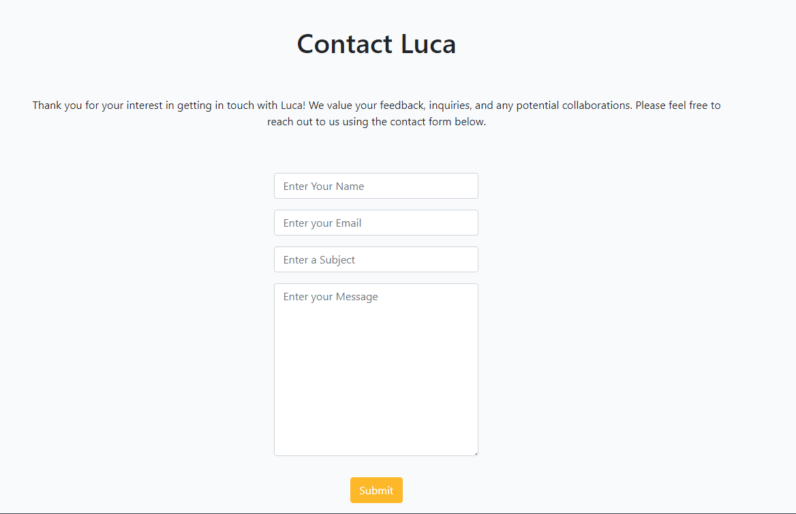

</details>
</br>

**Search Page**

The Search Page can be accessed by interacting with the Search Box in the header of the website. It includes:

* The Ability to search for specific blog posts based on a users interest.
* The search specifically checks the title of the blog post for a match.
* A clear message if no results matched your search.
* It displays blog posts for example if you search for 'Pizza' as per the screenshot examples below.

<details>
<summary>Click to view - Search Page Screenshots</summary>

**Search Page on Mobile**


**Search Page on Desktop**
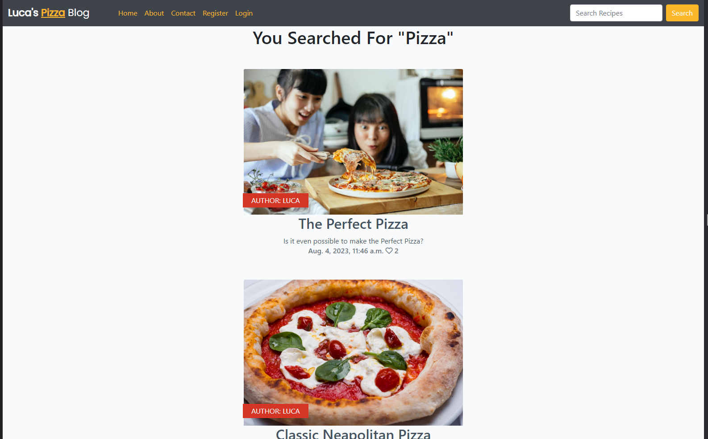

</details>
</br>

**Register Page**

The Register Page has the functionality which allows a user to register for an account.
* The fully responsive registration form can be accessed through the navigation bar.
* It confirms the registered account with messaging to the new user and redirects to the blog page once successfully registered
* The page is styled to match the rest of the website.
* A convenient hyperlink to the Login page is displayed incase the user already has an account.
* Django-allauth is used to provide all settings needed for user authentication for the following fields:
    - Username (required)
    - Email (Optional)
    - Password (Required)
    - Repeat Password (Required)

<details>
<summary>Click to view - Register Page Screenshots</summary>

**Register Page on Mobile**


**Register Page on Desktop**
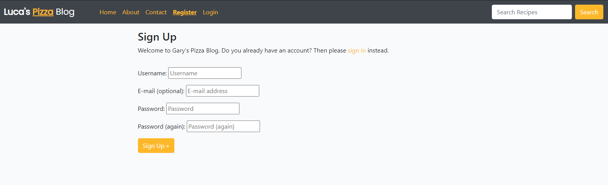

</details>
</br>

**Login Page**

A User who has registered and is returning to the website can access the login form through the navigation bar on all pages. It includes:
* The fully responsive login page can be accessed via the Nav bar if the user isn't already logged in.
* The page is styled to match the rest of the website.
* It uses django-allauth to provide the necessary settings for user authentication for the following fields:
    - Username (Required)
    - Password (Required)
* During the login process the user can tick 'Remember Me' if they want their logins saved.
* The form can be submitted by clicking the Sign In button.
* The User will be redirected to the homepage upon successful login.
* A convenient hyperlink to the Register page is displayed incase the user doesn't have an account.
* If the visitor doesn't have an account, there is a quick link to the register page.
* A message will be displayed to confirm that the login was successful.

<details>
<summary>Click to view - Login Page Screenshots</summary>

**Login Page on Mobile**


**Login Page on Desktop**
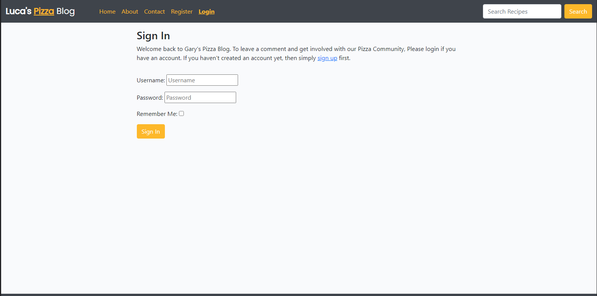

</details>
</br>

**Logout Page**

A logged in user can easily logout of their account for security purposes. It includes:
* The fully responsive logout page can be accessed via the Nav bar if a user is currently logged in.
* The page is styled to match the rest of the website.
* A Sign Out button can be clicked to sign the user out of the website.
* The User will be redirected to the homepage once logged out.
* A message will be displayed to confirm that the logout was successful.

<details>
<summary>Click to view - Logout Page Screenshots</summary>

**Logout Page on Mobile**


**Logout Page on Desktop**
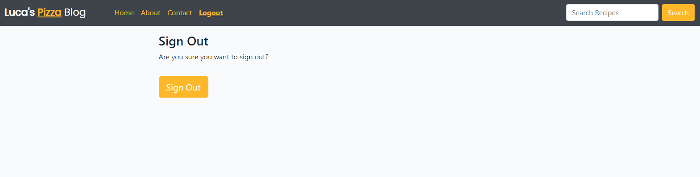

</details>
</br>

[Back to Top](#table-of-contents)

____

### Future Features

* Like / Unlike Heart buttons on Blog Posts currently refresh the page, I would like to implement a solution that requires AJAX.
* The ability to Reply to Comments so the blogger/user can respond to all comments received and the community can discuss the recipies in the comments.
* The ability for users to like other users comments.
* Single Sign-on using Google, Facebook or other authentication services.
* Have Approved Super users, after 10 comments a User should be upgraded to a higher user level, thus allowing them to comment without requiring admin approval.

[Back to Top](#table-of-contents)

____

## Technologies Used

### Languages

* [Python](https://www.python.org/downloads/release/python-3811/)
* [HTML5](https://www.w3schools.com/html/)
* [CSS3](https://www.w3schools.com/css/css_intro.asp)
* [JavaScript](https://www.w3schools.com/js/)

### Libraries & Frameworks

* [Django 3.2.20](https://www.djangoproject.com/) - Free and open source Python Web Framework.
* [Gunicorn 21.2.0](https://gunicorn.org/) - A Python WSGI HTTP server compatible with Django and used to run the project on Heroku.
* [PostgreSQL 0.5.0](https://www.postgresql.org/) - A powerful, open-source object-relational database system.
* [Pyscopg2 2.9.6](https://www.psycopg.org/docs/) - A PostgreSQL database adapter for Python.
* [Cloudinary 1.33.0](https://cloudinary.com/) - A persistent file store for media.
* [Whitenoise 6.5.0](https://whitenoise.readthedocs.io/en/latest/) - A Python library, built for serving static files.
* [Heroku](https://www.heroku.com) - A cloud platform as a service
* [ElephantSQL](https://www.elephantsql.com/) - PostgreSQL database hosting service
* [SQLite3](https://docs.python.org/3/library/sqlite3.html) - The database provided by Django
* [Django Allauth](https://django-allauth.readthedocs.io/en/latest/) - Integrated set of Django applications addressing authentication and registration
* [Bootstrap 4.6.2](https://getbootstrap.com/docs/4.6/getting-started/introduction/) - A Framework for building responsive, mobile-fist sites
* [Crispy Forms](https://django-crispy-forms.readthedocs.io/en/latest/) - Provides a |crispy filter and  tag that helps control the rendering behavior of Django forms.
* [Summernote 0.8.20.0](https://summernote.org/getting-started/) - a JavaScript library that helps you create WYSIWYG editors online

### Tools

* [GitPod](https://www.gitpod.io/) - Cloud development Environment used.
* [GitHub](https://github.com/) - Cloud based git repository used.
* [W3C Validator](https://validator.w3.org/) - Validator that checks the markup validity for Web Documents in HTML.
* [W3C CSS Validator](https://jigsaw.w3.org/css-validator/) - Validator that checks CSS validity.
* [Code Beautify](https://codebeautify.org/jsvalidate) - Validator that checks JS Validity.
* [Code Institute's Python Linter](https://pep8ci.herokuapp.com/) - Validator that checks syntax and stlistic problems in Python code.
* [Canva](https://www.canva.com/colors/color-palette-generator/) - Color Palette Generator
* [Am I responsive](https://ui.dev/amiresponsive) - Generates Responsive images for your website.
* [Chrome DevTools and Lighthouse](https://developer.chrome.com/docs/devtools/) - Web Developer Tools.
* [GIMP](https://www.gimp.org/) - Resizes, Crops and Edits images.
* [Pixabay](https://pixabay.com/) - Royalty Free images.
* [Pexels](https://www.pexels.com/) - Royalty Free Images.
* [Google Fonts](https://fonts.google.com/) - Fonts
* [Font Awesome](https://fontawesome.com/) - Icons
* [Balsamiq](https://balsamiq.com/wireframes/) - Low Fidelity Wireframes
* [draw.io](https://app.diagrams.net/) - Diagram Software


[Back to Top](#table-of-contents)

____

## Testing

View the [TESTING.md](TESTING.md) file for all testing information.

[Back to Top](#table-of-contents)

____

## Bugs

* ```name = models.CharField(max_length=80)``` - I had unique set to true which caused this error - IntegrityError at /breakfast-pizza/
duplicate key value violates unique constraint "blog_comment_name_key"

This was my first encounter with attribute based errors, fixing this one by using google allowed me to learn a lot more about various attributes throughout my project.

* I never imported messages from django.contrib and got this error - from django.contrib import messages

Don't forget to import!!

* I had the name field in my models.py file set to 'unqique' for class Comment - this prevented the same user from making more than 1 comment. Thanks to the first issue, this was solved quickly. But I only luckily found it via extensive testing.

* comment_delete function was missing an arguement and prevented comments from getting deleted. Updated the slug=slug here - ``post = get_object_or_404(queryset, slug=slug)``

* The search field I added was case sensitive. If you searched for 'pizza' no results would be found, while 'Pizza' worked fine. To fix this I changed my views.py filter to - ``recipes = Post.objects.filter(title__icontains=search)`` - You can also use 'contains'.

[Back to Top](#table-of-contents)

____

## Deployment

**1 - Database Setup** - I setup PostgreSQL database using ElephantSQL, I used these steps:
    - Create an account for ElephantSQL
    - Create a new instance with a unique name.
    - Select Tiny Turtle Plan (It's Free).
    - Select the closest region to you.
    - After it's created, document the Database URL and password.
<br>

____

**2 - Cloudinary API Integration** - To store media files online, I needed to integrate the Cloudinary API into my application by following these steps:
    - Create an account with Cloudinary.
    - On the Cloudinary Dashboard get your API Environment Variable
    - Copy the API key.
    - Add the API Key to the "DATABASE_URL" variable.
    - Be sure to install the package in your environment - pip3 install django-cloudinary-storage
<br>

____

**3 - Deploying on Heroku:**
    - Create an account with Heroku.
    - Create your new app via the Heroku Dashboard.
    - Access your app settings and set up Config Vars:
        - CLOUDINARY_URL - Copy and Paste your Cloudinary API Key.
        - DATABASE_URL - Use the ElphantSQL Postgres DB URL here.
        - SECRET_KEY - Generate a Secret Key in Django for this (I used [Django Secret Key Generator](https://djecrety.ir/))
        - DISABLE_COLLECTSTATIC=1 - I have this set during the building phase, prior to deployment.
    - Connect GitHub Repo to your Heroku App.
    - During the build phase I manually Pushed my code when needed. When I was ready to do my final deploy, I set it to automatic.
    - **Additional Notes** - Ensure you have your requirements.txt file updated after all package installs with pip3 freeze > requirements.txt in the terminal.
    - **Additional Notes** - Ensure you create your Procfile, to do this run this command - web: gunicorn projectfolder.wsgi:application (Replace projectfolder with your own name).

____

**4 - Create the env.py file**
With the database created and your initial Heroku setup completed. You now need to connect it within the project. Specific variables need to be kept secure and cannot be published to GitHub.
    - Create an env.py file and add it to .gitignore.
    - Put 'import os' at the top of the file. Set the DATABASE_URL variable using the ``os.environ`` method. Add the URL from your DB here like this - `` os.environ["DATABASE_URL"] = "secureURL" ``
    - Your SECRET_KEY you put into Heroku Config Vars needs to be entered into your env.py as well. ``os.environ["SECRET_KEY"] = "SecretKey"

____

**5 - Update settings.py file**
* Next we need to make our project aware of the env.py file in order to connect our environment to the new database.
    - Add the following if statement which allows the application to run without the env.py file:
    ```
        import os
    import dj_database_url

    if os.path.isfile(‘env.py’):
        import env
    ```
____

<br>

* Replace the insecure secret key provided by Django with:
    ``SECRET_KEY = os.environ.get('SECRET_KEY')``

* When testing and working locally, leave ``DEBUG = True`` in your settings.py file. When you are pushing to production, change this to ``DEBUG = False``

* Change the existing DB connection in settings.py to use a URL. Comment out the following:
```
        DATABASES = {
        'default': {
            'ENGINE': 'django.db.backends.sqlite3',
            'NAME': os.path.join(BASE_DIR, 'db.sqlite3'),
        }
    }
```

Replace with this.
``
    DATABASES = {'default': dj_database_url.parse(os.environ.get('DATABASE_URL')) }
``
____

* **Cloudinary & Whitenoise** - I used both Cloudinary and Whitenoise in my project, cloudinary for imagery and whitenoise for serving static files. As a result my set up was a bit unique.
    - Update your INSTALLED_APPS ensuring that they are in the correct order. Like so:
```
    'django.contrib.staticfiles',
    'cloudinary_storage',
    'cloudinary',
```
    - Add the following under MIDDLEWARE:
```
MIDDLEWARE = [
    'whitenoise.middleware.WhiteNoiseMiddleware',
]
```
    - You will need to go to the Cloudinary &
```
        MEDIA_URL = '/media/'
DEFAULT_FILE_STORAGE = 'cloudinary_storage.storage.MediaCloudinaryStorage'

STATIC_URL = '/static/'
STATICFILES_STORAGE = 'whitenoise.storage.CompressedManifestStaticFilesStorage'  # noqa
# STATICFILES_STORAGE = 'cloudinary_storage.storage.StaticHashedCloudinaryStorage'  # noqa

# STATICFILES_DIRS = [os.path.join(BASE_DIR, 'static')]
STATICFILES_DIRS = (os.path.join(BASE_DIR, 'static'),)
STATIC_ROOT = os.path.join(BASE_DIR, 'staticfiles')
```
____

* **Add Heroko Host Name**

In settings.py go to ALLOWED_HOSTS and add the Heroku Host name. When testing locally, you will also need to include the URL for your website after typing python3 manage.py runserver. 'localhost' can work, but for me it didn't.
This 8000-garys007 url reset for me on a weekly basis, so when you go to runserver and get an error. It will provide the new URL, simply replace the old one.
```
ALLOWED_HOSTS = [
    'garys-pizza-blog.herokuapp.com', 'garys-pizza-blog-f13a1d85eaa1.herokuapp.com',
    '8000-garys007-portfolioproje-3x6u80hitj3.ws-eu104.gitpod.io'
    ]
```

____

* **Forking Github Repo**

    - Locate the Github Repo, Link can be found [here](https://github.com/GaryS007/Portfolio-Project-4).
    - Click 'Fork' at the top right hand corner.
    - This will redirect you to your own repository to a fork with the same name as the original branch.

____

* **Creating a Local Clone**
    - Locate the Github Repo, Link can be found [here](https://github.com/GaryS007/Portfolio-Project-4).
    - Click on 'Code' over on the right hand side. Select HTTPs from the drop down and copy the URL.
    - Open Git Bash in your IDE and change the current working directory to the new location where you want the cloned directory.
    - Type ``git clone``, then simply paste the URL you copied in step 2.

You can read more information on how to do this through the offical GitHub Documentation [here](https://docs.github.com/en/repositories/creating-and-managing-repositories/cloning-a-repository).

[Back to Top](#table-of-contents)

____

## Credits

I used the following walkthroughs which really helped shape my project, I never copied and pasted any code, all code was written manually to ensure I understand every component of my application. I've always wanted to do a blog about Pizza as I own 2 Pizza ovens so the following really influenced my project:

* Code Institute's 'I Think Therefore I Blog' - This project was fantastic and simple. I really wanted to expand on this concept, changing elements and adding my own models. A big thanks for Code Institute for allowing us to use this as a base for my own blog.
* Another Code Institute MASTER CLASS via the [Django Blog Webinar](https://www.youtube.com/watch?v=YH--VobIA8c&ab_channel=MediaUpload). This really helped me solidify my knowledge with Django and generate new ideas.
* Code Institute Slack Community - I thought my questions were unique, being able to search through the past experiences of other students is extremely beneficial and really easy to use.
* Code Institute Tutors - When you really hit that coding wall after exhausting various options, you have a team of friendly helpful coders who can point you in the right direction.
* [Stackoverflow](https://stackoverflow.com/) - So much information, so many people problem solving and trying to help. A lot of time spent here.
* Youtube - I watched various tutorials from various sources, this would help with ideas, see how they approach implementing a solution so I can then implement it my own way. There are so many ways to do everything!
    - More specifically, Corey Schafer and John Abdsho Khosrowabadi videos I found extremely helpful.
    - ChatGBT helped me generate meaningful text for the website.
    
**Media**

All images were taken from Pexels & Pixabay, however 1 image is my own Pizza Oven and Pizza which I'm very proud to include in my blog.

____

## Acknowledgements

A Special Thanks to everyone who helped me with this project.
* My Mentor Jubril Akolade who really helped guide me on exactly what I need to do, spot what I was missing. Extremely professional and easy to work with.
* My friends and family who helped me with testing as well as feedback throughout development.
* My study group for sharing about their projects throughout each project.
* Again I have to thank Tutor Support as they're amazing.
* Also Student Support for supporting me through tough times during this project.
    
[Back to Top](#table-of-contents)

____


