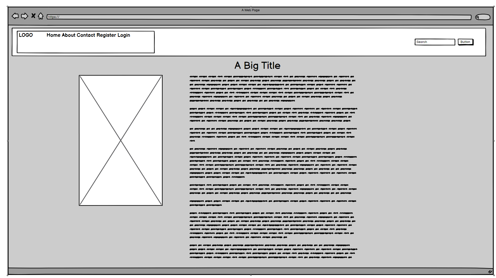
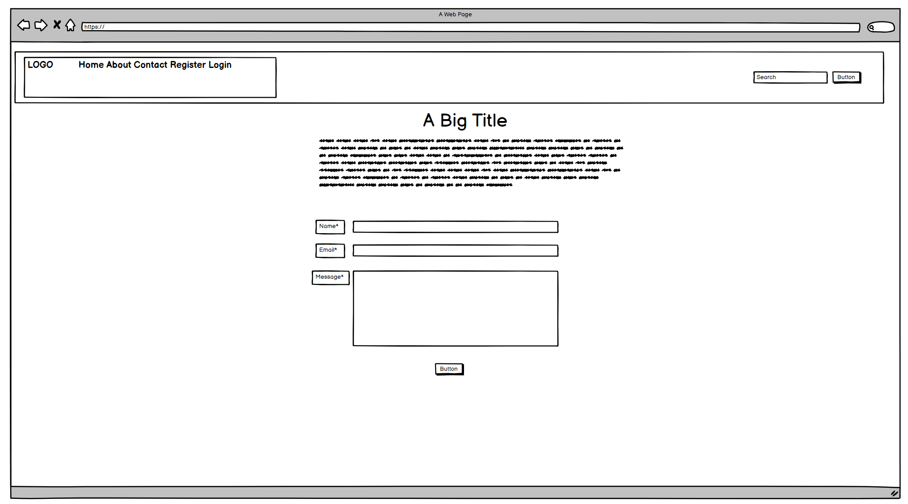
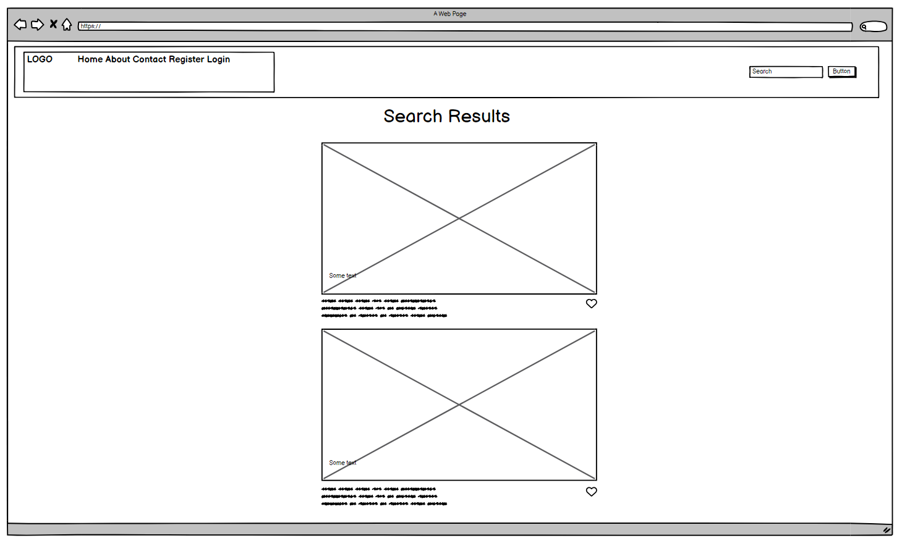
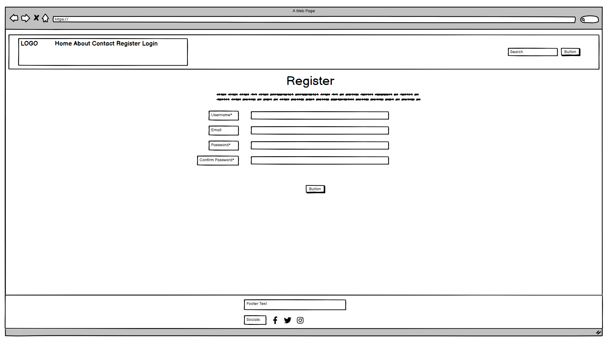
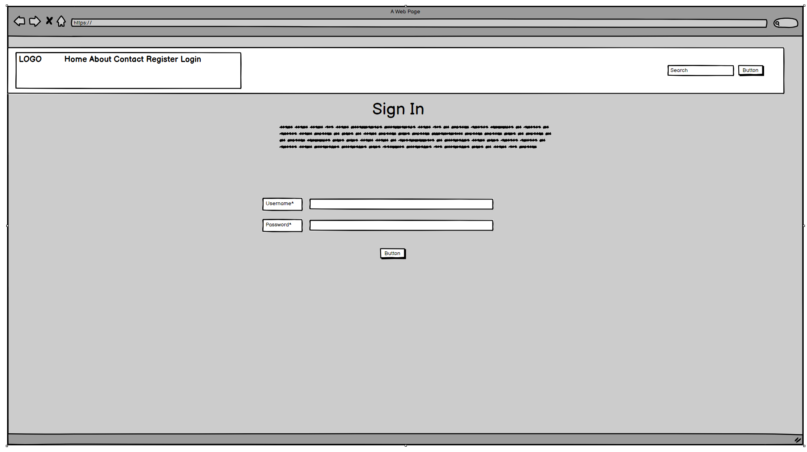
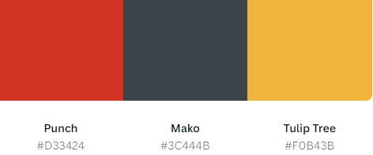
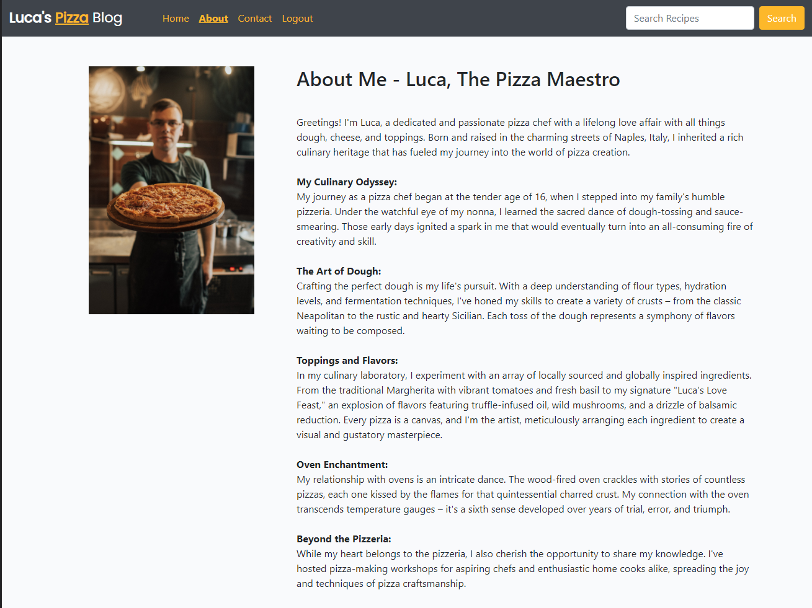

# Luca's Pizza Blog

Luca's Pizza Blog is a full-stack, responsive website built for a Pizza Chef looking to share and educate users on the art of pizza.

It provides the user value by learning about the blogger and recipes they post about. It has a Search Box that enables the user to search for specific recipes. Users can register an account, view blog posts, like blog posts and add / edit / delete comments they make on a specific blog post.

# RESPONSIVE IMAGE GOES HERE

# LINK TO WEBSITE WILL GO HERE

## Table of Contents
* [Overview](#overview)
* [Agile Methodology](#agile-methodology)
* [User Experience (UX)](#user-experience-ux)
    * [Site Goals](#site-goals)
    * [Scope / User Stories](#scope--user-stores)
    * [Wireframes](#wireframes)
    * [Design Choices](#design-choices)

____

## Overview

Luca's Pizza Blog is a responsive, mobile-first website. It is compatiable with all current major browsers. The website is built for educational purposes, using Bootstrap and Django Framework. It gives users the ability to register for an account, like blog posts, add comments, edit & delete their comments. Full CRUD functionality on comments. As well as an About Page for users to read more about Luca and his experience as a Pizza Chef.

[Back to  Top](#table-of-contents)

____

## Agile Methodology

This project was planned using Agile Methodology. GitHub Issues was used to create user stories which can be viewed [here](https://github.com/GaryS007/Portfolio-Project-4/issues). Each User Story helped me understand a User/Admin requirements when using the blog site I had in mind. This was my first time using this methodology and the Django framework, so I feel like I could have used the user stories to dictate the priority of each future iteration. All of which can be implemented in Project 5.

I really felt that using Agile Method helped me stay focused on what tasks need to be completed. I can simply move a task to To Do for the next day and plan out which tasks can be completed so I stay focused and on schedule with my project. It also really helps manage expectations and time. Finally, who doesn't love putting a task in the 'done' section when completed!

[Back to Top](#table-of-contents)

____

## User Experience (UX)

### Site Goals

Luca's Pizza Blog is designed to entice people into learning about various pizza recipes but also to engage with a pizza chef and pizza community. It displays Blog Posts on the homepage with vibrant images and short descriptions to entice new users. Each Blog Post contains a new and unique recipe, which enables the user to engage with that content by liking or commenting on the post. It also provides information about the Pizza Chef via the about page. I wanted to include additional functionality by enabling any user to Search or Filter for recipes that they might be more interested in. This feature will become increasingly more useful as more blog posts get added, preventing the need to scroll through pages of content.

The target audience are pizza lovers of all ages that want to gain additional experience from a trained pizza chef.

____

### Scope / User Stores

** As a Site Admin / Blog Owner **

* I can create, read, update and delete posts which enables me to manage my blog content.
* I can Approve / Dissapprove user comments to prevent spam and to filter out negative comments.
* I can create a blog post draft so that I can save that draft and finish it later.
* I can view the number of likes and comments on each post so that I can see which post is the most successful.

** As a User **
* I can see the website's logo and links at the top of the page so that I can easily navigate to all parts of the website.
* I can click on a blog post and read the full post.
* I can read more information about the blogger.
* I can use the search box to search for specific recipes.
* I can Register a new account so I can post, like and comment.

** As a Returning User **
* I can use my Username and Password in order to login to my account.
* I can log out of my account to keep my account safe and also be notified upon logging out.
* I can post a comment on a specific blog post.
* I can like or unlike blog posts so that I can interact with the content.
* I can Edit / Delete a comment made by my account.

____

### Wireframes

I created Wireframes using [Balsamiq](https://balsamiq.com/wireframes/) to help visualize how the final site would look and to allow me to plan accordingly. This method really helps me know where each element needs to go, while it might not look the same as the final version, it allows me to tick a lot of boxes then I can make final changes during the building phase where necessary.

**Homepage**

Click to view - Homepage Wireframes

#### Mobile

#### Desktop

 

**Blog Post**

Click to view - Blog Post Wireframes

#### Mobile

#### Desktop

 

**Edit Comment - Blog Post**

Click to view - Edit Comment Wireframes

#### Mobile

#### Desktop

 

**Delete Comment - Blog Post**

Click to view - Delete Comment Wireframes

#### Mobile

#### Desktop

 

**About Page**

Click to view - About Wireframes

#### Mobile

#### Desktop

 

**Contact Page**

Click to view - Contact Page Wireframes

#### Mobile

#### Desktop

 

**Search Page**

Click to view - Search Page Wireframes

#### Mobile

#### Desktop

 

**Register User Page**

Click to view - Register/Signup Page Wireframes

#### Mobile

#### Desktop

 

**Login Page**

Click to view - Login Page Wireframes

#### Mobile

#### Desktop

### Design Choices

This section defines the visual decisions of the website

* Colour Scheme

Using [Canva](https://www.canva.com/colors/color-palette-generator/) a Black, Yellow and Red colour palette was chosen for this website. Keeping the Header Black with the Yellow colour to allow all nav items and buttons to pop. Then I kept the Red as that is a general pizza colour (tomato sauce!) which felt very relevant for the blog. It resulted in a professional yet vibrant feel to the website.

Punch (Red) was used to provide the pop of colour where needed.
Mako (Black) was used for the header and footer for the professional look.
Tulip Tree (Yellow) was used for Navigation, Buttons and some in the text logo.

* Typography

[Google Fonts](https://fonts.google.com/) Poppins and Lato were used throughout the site. Both of which are Sans-Serif and make the site very readable.

* Icons

[Font Awesome](https://fontawesome.com/) icons were used throughout the website, primarily in the Footer for social icons and also on the blog page for Likes and Comment icons. All of which are interactive.

[Back to Top](#table-of-contents)

____

## Features

### Existing Features

**Header & Nav**

The header and navigation are featured on all pages and are fully responsive. They include:

* A friendly yet simple logo.
* When on Mobile the navigation can be accessed through the traditional burger menu. Once clicked the drop down will display each individual page including; Home, About, Contact, Login, Register, Logout and a search box. The burger menu keeps the focus on the content of the page and has become a very familiar method among mobile users to access the navigation items. All links have hover effects and active effects when a main page is accessed.

The search box enables users who want to search for a specific recipe or blog post that would suit their interests. 
* The Login/Register/Logout options change depending on the users status. If they're not logged in, they will be given an option to Register or Login. If they are logged in, the previously mentioned items will disappear and the only remaining option will be Logout.
* When on Desktop the activity is the same but the menu items are not collapsable like in the burger menu.

Click to view - Navigation Features

**Mobile & Desktop Navigation**

**Closed Menu Mobile**

 

**Open Menu Mobile**

 

**Desktop Navigation**

[Back to Top](#table-of-contents)

 

**Footer**

Just like the header and nav, the Footer is featured on all pages and is responsive. The footer enables visitors to the website to view the bloggers social links so they can further network and view the bloggers content on other platforms/applications. It includes:

* Short attractive summary of website.
* Vibrant Social Media Icons allowing users to connect further with Luca.
* Copyright information in a subtle colour.

Click to view - Footer Features

**Footer on Mobile**

**Footer on Desktop**

**Homepage**

The Home Page which is responsive, displays all blog posts, each post has an attractive image and excerpt to attract users. It includes:
* Vibrant Imagery relevant to the blog post to entice a click.
* Each Image and Title is a clickable URL which will take them to the blog post. This makes it more mobile friendly when the image is clickable.
* Each blog post contains a title and excerpt to provide additional information on what the post is about.
* The popularity of the Blog post is displayed via the Heart Icon.
* The Author is posted over the image so they can see who made the post.
* The date and time is displayed so the user can see when the post was made.
* The next button is at the bottom of the page content so users can read more posts.

Click to view - Homepage Features

**Home Page on Mobile**

**Home Page on Desktop**

 

**About Page**

The About Page which is responsive, can be accessed via the navigation bar at the top of the website. This page can be managed via Django Admin, allowing the blogger who may not have any website experience to quickly and easily change the image or content. It includes:
* Detailed information about Luca, why he created the blog, his history and experience. For anyone reading the blog posts, this page allows users to understand and connect with Luca even more.
* An Image of Luca in his element showing off his Pizza.

**About Page on Mobile**

**About Page on Desktop**

 

____

## Future Features

[Back to Top](#table-of-contents)

____

## Technologies Used

[Back to Top](#table-of-contents)

____

## Testing

### Bugs

### Deployment

## Credits

