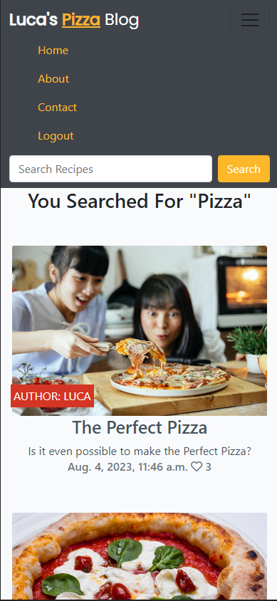
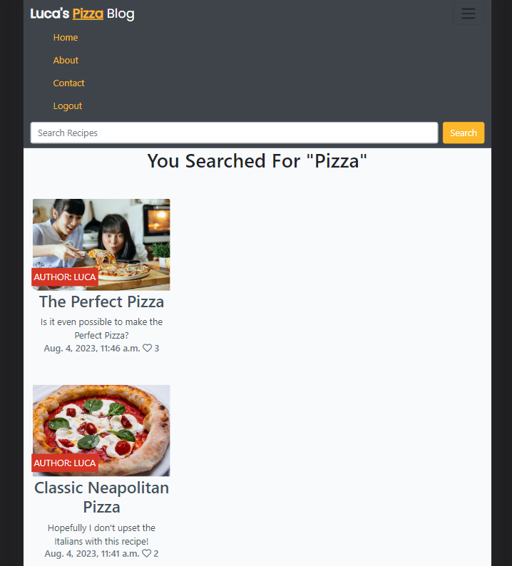

## Testing

**Test Cases**

| Case | Screenshot    | Achieved |
| :---:   | :---: | :---: |
| As a Pizza Lover, I can easily view Blog Posts in relation to Pizza. |    | Yes   |
| As a Pet Owner, I can securely and conveniently book a pet sitting service with my chosen Minder, specifying the start date, end date and the service description, so that I know when the minder will arrive and leave. |    | Yes   |
| As a Pet Owner, I can check the status of my booking, if it is accepted, declined, completed or pending, so that I can stay informed about the progress of my booking. |    | Yes   |
| As a Pet Owner, I can have a friendly interface to manage and review my current and past bookings and edit my profile, so that I can have a place to view all of my booking information and make changes to my profile as needed. |    | Yes   |
| As a Minder, I can showcase my experience, skills, and availability through my profile, so that Pet Owners can find me and book my services. |    | Yes   |
| As a Minder, I can receive booking requests from Pet Owners, including all the necessary details about the pet, service duration, and any specific service instruction, so that I understand the requirements of the job. |    | Yes   |
| As a Minder, I can efficiently manage and organize my bookings, including accepting or declining requests based on my availability, updating the status of active bookings, so that I can ensure that all of my bookings are handled in a timely and efficient manner. |    | Yes   |
| As a Minder, I can have a friendly interface to edit my profile, so that I can make updates as required. |    | Yes   |
| As a Minder, I can have a friendly interface to edit my profile, so that I can make updates as required. |    | Yes   |
| As the Site Owner, I want to ensure the security and privacy of user information, implementing authentication and data protection measures to safeguard sensitive data, so that users can trust the platform. |    | Yes   |
| As the Site Owner, I want to have an administrative dashboard to manage user accounts and track bookings, so that I can effectively manage the site and ensure that it is running smoothly. |    | Yes   |
---

## Responsivness

I have tested my deployed website on Mobile and Tablet to ensure each page was responsive.

| Page | Phone | Tablet |
| --- | --- | --- |
| Home page |  |  |
| About Page |  |  |
| Sign in page |  |  |
| Sign out page |  |  |
| Contact page |  |  |
| Search Page |  |  |
| Edit and Delete Comments |  |  |