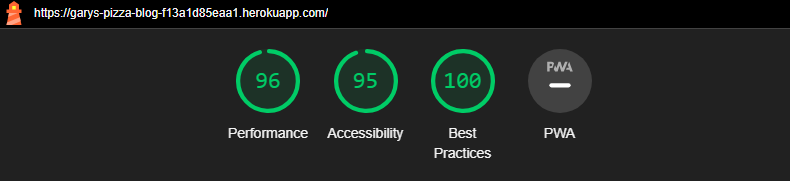

# Testing

Go back to the [README.md](README.md) file.

## Code Validation

### HTML

I used [HTML W3C Validator](https://validator.w3.org/) for testing and validation for all of my HTML files.

* The code for all Python files was tested against [CI Python Linter](https://pep8ci.herokuapp.com/)
* The code for all HTML files was tested against [W3C Markup Validation Service](https://validator.w3.org/)
    - HTML had 2 minor issues on the About Page. The page content is generated via Django admin.
    - No p element in scope but a p end tag seen. - There is a P element, so I'm confused on this one but will aim to fix it but it seems to be related to how Django generates the content. Will look deeper.
    - Bad value 75% for attribute width on element img: Expected a digit but saw % instead. This was then fixed by removing it from HTML and creating a CSS rule in it's place.
* The code for the CSS File was tested against [W3C CSS Validation Service](https://jigsaw.w3.org/css-validator/)
* The code for the JS file was tested against [JSHint](https://jshint.com/)

### CRUD (Create, Read, Update and Delete)

As a result of manual testing, the following was tested and confirmed as working. All tests were successfull and provided appropriate alert messages to confirm.

| Create | Read  | Update | Delete |
| :---:   | :---: | :---: | :---: |
| Create Comment | View Comment  | Edit Comment  | Delete Comment |
| Success | Success  | Success  | Success |

### Manual Testing

| Page | User action | Expected result | Pass/fail |
| --- | --- | --- | --- |
| Home page | Click on Blog Post | Redirected to correct blog post | Pass |
| Home page Logo | Click on logo | Redirected to home page | Pass |
| Home page Next| Click on Next button | Redirected to next page of blog posts | Pass |
| Navigation | Click on each navigation item | Redirected to the correct page | Pass |
| Navigation | Test Hover | Each navigation item highlights when you hover. | Pass |
| Navigation | Test Active | Each navigation item goes bold and underlined when you click on a page in nav. | Pass |
| Navigation Search | Enter a search term related to Pizza | Redirected to search page with search term passed through | Pass |
| Footer | Click Social Links | Each Social link works as expected | Pass |
| Register | Fill in Register Form | Register Page has 4 Form Fields, 3 of which are mandatory and 1 optional. Account is created when you click Sign Up. | Pass |
| Login | Fill in Login Form | Test Login with correct username and pass  | Pass |
| Login | Fill in Login Form | Test Login with incorrect username and pass (expect error)  | Pass |
| Logout | Click Logout | Click Sign-Out button and user will successfully be signed out and redirected to Home | Pass |
| Comments | Cannot comment unless logged in | Appropriate message is displayed and you cannot make a comment unless logged in | Pass |
| Comments | Create Comment if logged in | Comment Submission box appears when user is logged in and comment can be made successfully | Pass |
| Comments | Awaiting Moderation | Once a comment has be submitted successfully it will not be posted until Moderator Approval | Pass |
| Edit Comment | Edit Button | Upon clicking the edit button, my comment should automatically appear in the comment body section and the button should change to 'Update' | Pass |
| Delete Comment | Delete Button | After leaving a comment, whether approved or not, a Delete button should be present | Pass |
| Delete Comment | Delete Button Modal | After clicking Delete, a Modal should appear with a confirm choice option. Test both options. | Pass |
| About Page | Check Content | Content from this page is populated by Django and appears correctly. | Pass |
| Contact Page | Fill In Contact Form | Contact Form has 4 Fields all are mandatory. Submit form and the submission will be confirmed | Pass |
| Alert Messages | Check Alert Messages | There are Alert Messages for all Submissions - Comments(Edit/Delete), Sign In, Logout, Register, Contact and all of which should display an alert message. | Pass |

## Responsivness

I have tested my deployed website on Mobile and Tablet to ensure each page was responsive.

| Page | Phone | Tablet |
| --- | --- | --- |
| Home page |  |  |
| About Page |  |  |
| Login page |  |  |
| Logout page |  |  |
| Contact page |  |  |
| Search Page |  |  |
| Edit and Delete Comments |  |  |

## LightHouse Testing

Google Chrome Built Lighthouse was tested in Incognito Mode to test all pages.

